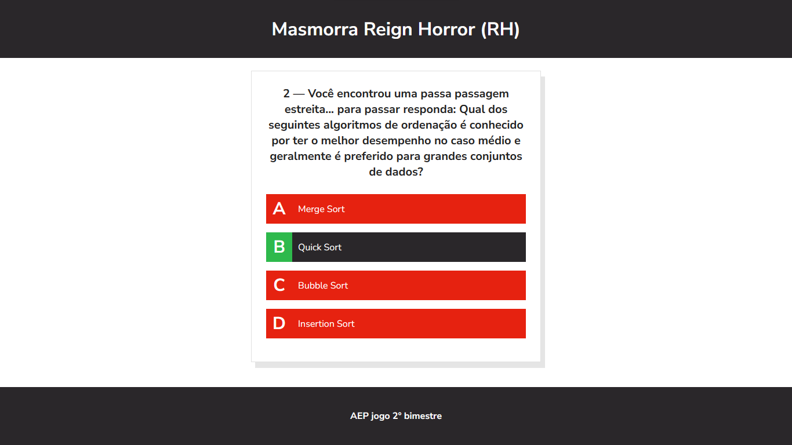
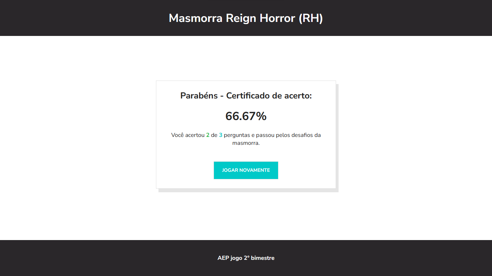

# Quiz Certification Project

This repository houses a Quiz Certification Project, developed for a college assignment. The project is a quiz game that covers topics taught during the semester. The goal is to provide users with a certification upon successful completion of the quiz.





## Features

- Interactive Quiz Interface
- Multiple-choice Questions
- Bootstrap for Responsive Design

## Technologies Used

- HTML
- JavaScript
- Bootstrap

## Getting Started

To run the quiz locally, follow these steps:

1. Clone the repository:

   ```bash
   git clone https://github.com/your-username/quiz-certification.git
